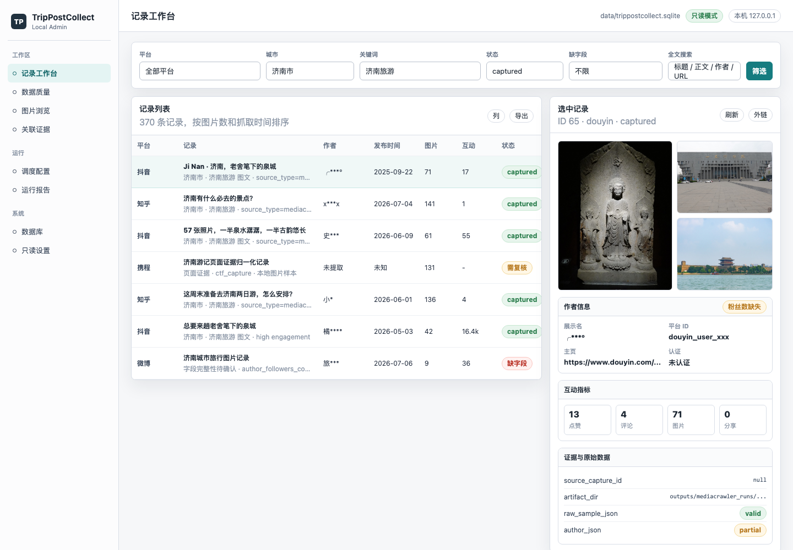

# TripPostCollect 可视化管理客户端开发文档

## 目标

建设一个面向本项目 SQLite 数据库的本地/内网管理台，以“记录”为核心查看和管理图文内容线索。用户先通过平台、城市名、关键词、状态和时间等条件筛选出符合条件的记录，再围绕选中记录查看图片预览、作者信息、互动指标、页面证据和原始 JSON。客户端不是新的抓取器，不绕过现有 `crawl_runner.py`、`mediacrawler_crawl.py`、`ctf_resource_crawl.py` 和入库脚本；首版管理端 HTTP API 只读，负责实时呈现数据库最新状态，不负责修改记录。

首版采用正式产品化技术栈：

- 后端：FastAPI + Python 标准 `sqlite3`，必要时引入 Pydantic 模型。
- 前端：React + TypeScript + Vite。
- UI：自建轻量组件层，优先使用成熟表格和表单库；视觉风格保持运维后台式、信息密度高、克制。
- 数据库：继续使用 `data/trippostcollect.sqlite`，不改变现有抓取入口。

官方技术依据：

- FastAPI 可与任意 SQL/NoSQL 数据库库配合；官方 SQL 数据库教程示例使用 SQLModel/SQLAlchemy/Pydantic，并说明 SQLite 是单文件、Python 集成支持的数据库选择。
- Vite 是现代前端构建工具，提供开发服务器和生产构建；官方模板支持 `react-ts`。
- React 官方建议生产应用从框架开始；本项目选择 React + Vite 是因为管理台主要是本地 SPA，后端已由 FastAPI 承担。

## 非目标

- 不重新实现抓取逻辑。
- 不直接从 UI 高频触发线上平台抓取。
- 不从 UI 触发真实抓取、sync、bootstrap 或 dry-run；抓取、调度同步和数据库维护仍从命令行进入。
- 不把 `ctf_captures` 当作普通内容表随意修改。
- 不在 UI 中手工新增、修改、软删除或物理删除记录；记录新增只来自现有抓取和入库链路，记录修正通过受控终端脚本处理。
- 不在 UI 中修改、重排、替换或删除记录图片行；图片新增和更新默认来自入库链路。
- 不在首版实现多用户协作、远程公网部署、复杂 RBAC 或 OAuth。
- 不让前端直接访问 SQLite 文件或本地任意路径。
- 不在 UI 中编辑 `source_platforms` 数据库行；平台注册源头是 `trippostcollect.platforms.registry`。
- 不在 UI 中直接编辑 `crawl_jobs` 行；调度源头仍是 `config/crawl_targets.json`，同步入口仍是命令行 `crawl_runner.py --sync-only`。

## 设计原则

1. 管理台第一入口是记录筛选和记录工作台，不是数据库表导航。
2. `web_posts` 是记录主表；产品语言统一称为“记录”，表名只作为实现细节出现。
3. 平台和城市名是首要筛选维度，允许只按城市名筛选，也允许平台 + 城市组合筛选；管理端城市控件使用山东十六市固定选项。
4. 图片、作者、互动指标、证据和 JSON 都是选中记录的上下文面板。
5. `web_post_images` 是记录图片子表，首版只读展示和预览；新增、替换、排序和删除默认由入库链路或后续终端维护脚本完成。
6. `ctf_captures` 和 `ctf_capture_images` 是证据/调试底座，默认只读；通常从关联记录进入。
7. 调度配置和运行报告在管理端只读；修改配置、sync、dry-run 和真实抓取继续使用命令行。
8. 图片读取必须经过后端代理，本地文件只允许读取项目目录内白名单路径，远程图片只允许读取数据库已有且通过安全校验的 URL。
9. 首版管理端不提供写入 HTTP API；需要修正、隐藏、重导入或维护时，通过受控终端脚本完成并在脚本层做备份和审计。
10. 管理端支持抓取脚本运行期间实时读取最新数据库状态，但不主动改变数据库结构、调度配置、抓取任务或内容记录。
11. 保留记录原始 JSON、关联证据原始 JSON、HTML、截图和图片证据；字段归属必须清楚，不把 `ctf_captures.raw_meta_json` 当作 `web_posts` 字段。
12. `published_at` 只能表示平台原始发帖时间；UI 不提供“一键用抓取时间填充”的功能。
13. 视频记录仍不进入内容主表；UI 只展示跳过原因或证据，不提供视频处理能力。

## 核心对象：记录

管理台的核心对象是“记录”。一条记录以 `web_posts` 的一行为主体，并按需聚合以下信息：

- 平台信息：`source_platforms`。
- 图片信息：`web_post_images`。
- 作者信息：`web_posts` 的作者字段和 `author_json`。
- 互动指标：点赞、收藏、评论、转发、浏览量和 `metrics_json`。
- 证据信息：`source_capture_id` 关联的 `ctf_captures`。
- 证据图片：关联证据下的 `ctf_capture_images`。
- 记录原始数据：`web_posts.raw_sample_json`、`web_posts.metrics_json`、`web_posts.author_json`。
- 关联证据原始数据：通过 `source_capture_id` 读取 `ctf_captures.raw_meta_json`、截图、HTML、可见文本和证据图片。

前端不应该把 `web_posts`、`web_post_images`、`ctf_captures` 暴露成并列的主工作区。它们在界面上应被组织为：

```text
筛选条件 -> 记录列表 -> 选中记录 -> 图片 / 作者 / 内容 / 互动 / 证据 / JSON
```

只有调度、运行报告、系统设置这类不依附于单条记录的能力，才作为独立导航入口。

## 产品范围

### 用户

首版面向单人使用：项目维护者或数据整理者。

典型任务：

- 选择平台、山东十六市城市项，或只选择城市，筛选出符合条件的记录。
- 在记录列表中快速判断平台、标题、作者、粉丝量、城市、发布时间、图片数和状态。
- 打开一条记录后查看其图片预览、作者信息、正文、互动指标、证据和原始 JSON。
- 找出缺图片、缺发布时间、缺作者粉丝量的记录。
- 在抓取脚本运行过程中，通过刷新或自动轮询看到新入库记录、图片和运行报告。
- 打开记录对应截图、HTML、可见文本和 JSON 原始证据。
- 查看 `crawl_targets.json` 中的长期任务和当前任务状态。
- 查看运行报告，不从前端触发 bootstrap、sync、dry-run 或真实抓取。

### 工作区

| 工作区 | 作用 | 首版要求 |
|---|---|---|
| 记录工作台 | 按平台、城市、关键词、状态、时间筛选记录，并显示记录列表 | 必做，默认首页 |
| 记录详情 | 围绕单条记录只读展示图片、作者、内容、互动、证据和 JSON | 必做 |
| 数据质量 | 以记录为单位查看缺图片、缺发布时间、缺作者粉丝量等问题 | 必做 |
| 图片浏览 | 从记录进入图片墙、缩略图和原图预览 | 必做，作为记录上下文 |
| 证据查看 | 从记录进入关联 `ctf_captures`；允许独立查询证据 | 必做，只读 |
| 调度配置 | 查看 `config/crawl_targets.json` 和同步后的任务状态 | 必做，只读 |
| 运行报告 | 查看 `crawl_run_reports` 和摘要文件 | 必做，只读 |
| 系统设置 | DB 路径、只读模式、刷新频率、维护命令说明 | 二期 |

## 信息架构

```text
TripPostCollect Admin
  记录工作台
    筛选器
      平台
      城市
      关键词
      状态
      发布时间
      抓取时间
      缺字段
    记录列表
    记录详情
      图片预览
      作者信息
      内容正文
      互动指标
      证据与原始数据
      刷新状态
  数据质量
    缺图片记录
    缺发布时间记录
    缺作者字段记录
    问题记录定位
  图片浏览
    当前记录图片
    缩略图
    原图预览
  证据
    关联证据
    独立证据查询
    证据详情
  调度
    任务配置
    Dry-run 预览
    运行报告
  设置
    数据库
    只读状态
    刷新频率
```

## 前端静态模板

首版视觉方向先以静态模板固定：本机后台、记录工作台、高密度表格、右侧记录上下文，不做营销页，不做表级数据库浏览器。

- HTML 模板：[admin-client-record-workbench-template.html](admin-client-record-workbench-template.html)。
- PNG 预览：[assets/admin-client-record-workbench.png](assets/admin-client-record-workbench.png)。



## 技术架构

```text
apps/admin_web
  React + TypeScript + Vite
  -> HTTP JSON API

apps/admin_api
  FastAPI
  -> trippostcollect.records
  -> trippostcollect.db
  -> trippostcollect.artifacts
  -> trippostcollect.scheduler

src/trippostcollect
  共享领域代码
  -> sqlite3
  -> config/crawl_targets.json
  -> outputs/ and data/runtime summaries

data/trippostcollect.sqlite
outputs/
data/runtime/
config/crawl_targets.json
```

后端是唯一允许访问 SQLite、配置文件和本地证据路径的进程。前端只通过 API 获取数据和图片。现有抓取脚本和新管理台不应该各自实现一套数据库访问、路径解析、平台映射或记录聚合逻辑；这些能力必须下沉到 `src/trippostcollect/`。

## 项目结构

当前项目分为四层：

- `apps/`：可运行应用，包括管理端 API 和管理端 Web。
- `src/trippostcollect/`：项目共享 Python 包，承载数据库、记录、证据、调度、抓取编排等领域代码。
- `scripts/`：CLI、抓取器和入库命令，直接引用共享包。
- `data/`、`outputs/`、`temp/`、`tools/`：继续作为运行数据、证据产物、临时验证和第三方工具目录，不混入应用源码。

### 关键目录

```text
apps/admin_api/          FastAPI 管理端
apps/admin_web/          React/Vite 管理端
src/trippostcollect/     项目共享 Python 包
scripts/                 抓取、入库和维护 CLI
db/                      SQLite schema
config/                  正式任务配置
data/                    SQLite 和运行状态
outputs/                 当前运行产物
tools/MediaCrawler/      第三方抓取工具
```

### 目录职责

| 目录 | 职责 | 状态 |
|---|---|---|
| `apps/admin_api/` | FastAPI 管理端，只处理 HTTP、依赖注入、响应模型和权限边界 | 当前实现 |
| `apps/admin_web/` | React/Vite 管理端前端 | 当前实现 |
| `src/trippostcollect/core/` | 路径、时间、配置、JSON、子进程固定命令模板 | 当前实现 |
| `src/trippostcollect/db/` | SQLite 连接、bootstrap、迁移、通用 repository 基础能力 | 当前实现 |
| `src/trippostcollect/platforms/` | 平台注册、平台 key、平台展示名、默认 URL 和风险配置 | 当前实现 |
| `src/trippostcollect/records/` | 记录列表、记录详情上下文、图片、作者、互动、质量检查 | 当前实现 |
| `src/trippostcollect/artifacts/` | 本地文件白名单、图片代理、截图/HTML/文本读取 | 当前实现 |
| `src/trippostcollect/scheduler/` | 任务配置和只读调度查询 | 当前实现 |
| `scripts/` | CLI、抓取器和入库命令 | 直接引用 `trippostcollect` 包，不设置兼容 wrapper |
| `db/` | SQL schema 仍作为数据库结构权威文件 | 保留根目录，避免和运行库混淆 |
| `tools/MediaCrawler/` | 第三方工具 | 不移动，不改成项目源码 |
| `data/`、`outputs/`、`temp/` | 数据库、浏览器状态、运行产物、临时验证 | 不移动，只通过 `core.paths` 访问 |

### 命令入口

当前命令入口：

```bash
source .venv/bin/activate
python scripts/crawl_runner.py --sync-only
```

```bash
source .venv/bin/activate
python scripts/crawl_runner.py \
  --dry-run \
  --max-jobs 5
```

```bash
source .venv/bin/activate
python scripts/mediacrawler_crawl.py \
  --platforms xhs \
  --keyword 济南旅游 \
  --candidate-hard-limit 20 \
  --target-valid-posts 0 \
  --login-type cookie \
  --headed \
  --no-import
```

### Python 包安装与导入

`src/trippostcollect/` 是标准 Python 包，不依赖临时 `PYTHONPATH`。仓库根目录的 `pyproject.toml` 声明：

```toml
[build-system]
requires = ["setuptools>=68"]
build-backend = "setuptools.build_meta"

[project]
name = "trippostcollect"
version = "0.1.0"
requires-python = ">=3.11"
dependencies = []

[tool.setuptools.packages.find]
where = ["src"]
```

开发管理端前，安装 editable 包及开发工具：

```bash
source .venv/bin/activate
python -m pip install -e '.[dev]'
```

安装后，CLI、FastAPI app 和测试都直接 `import trippostcollect`。不得让 `apps/admin_api` import `scripts/*.py`，也不要通过在命令前临时设置 `PYTHONPATH=src` 作为正式方案。

### 路径规则

- Python 代码只允许引用 `trippostcollect.core.paths` 或后端 settings。
- 不移动 `data/`、`outputs/`、`temp/` 和 `tools/MediaCrawler/`，避免破坏既有运行产物、浏览器 profile 和第三方工具路径。
- 管理端文件代理必须通过 `trippostcollect.artifacts` 做白名单检查，不允许自行拼本地路径。
- 数据库 schema 文件继续留在 `db/`；`trippostcollect.db.bootstrap` 负责定位和执行 schema。

## 后端技术设计

### 运行方式

开发期：

```bash
source .venv/bin/activate
python -m pip install -e .
python -m uvicorn apps.admin_api.app.main:app \
  --reload \
  --host 127.0.0.1 \
  --port 8787
```

生产/本机常驻期：

```bash
source .venv/bin/activate
python -m pip install -e .
python -m uvicorn apps.admin_api.app.main:app \
  --host 127.0.0.1 \
  --port 8787
```

### 依赖建议

Python 依赖：

- `fastapi`
- `uvicorn`
- `pydantic`
- `python-multipart`，用于未来上传图片或导入文件
- 暂不强制 ORM，首版直接用 `sqlite3.Row` + 显式 SQL，减少与既有 schema 演进的摩擦

是否引入 SQLAlchemy/SQLModel：

- 首版不引入。
- 原因：当前表来自 SQL 文件和 `ALTER TABLE` 演进，字段多、JSON 字段多、写入边界特殊，显式 SQL 更透明。
- 二期如果需要更复杂的模型校验，再评估 SQLModel。

### SQLite 连接策略

- 每个请求打开短连接，设置 `row_factory=sqlite3.Row`。
- 管理端 HTTP API 首版只读；默认使用只读连接打开 SQLite，不在请求中写入业务表、配置表、调度表或证据表。
- 设置 `PRAGMA foreign_keys = ON` 和合理的 `PRAGMA busy_timeout`，避免抓取脚本短事务写入时管理端读请求立即失败。
- 启动时只做 schema/status 检查，不执行会修改数据库的 `bootstrap_database()`、平台注册同步或 `crawl_jobs` 同步。
- 管理端不长期持有全局连接，不做长事务和大范围无分页查询。

建议封装：

```python
def connect_readonly_db(db_path: Path) -> sqlite3.Connection:
    uri = f"file:{db_path}?mode=ro"
    conn = sqlite3.connect(uri, uri=True)
    conn.row_factory = sqlite3.Row
    conn.execute("PRAGMA foreign_keys = ON")
    conn.execute("PRAGMA busy_timeout = 5000")
    return conn
```

抓取脚本运行过程中，管理端通过重新查询 SQLite 获得最新记录、图片、证据和运行报告；这属于实时读取，不属于 sync 或 bootstrap。

### 配置

环境变量：

| 变量 | 默认值 | 用途 |
|---|---|---|
| `TRIPPOST_ADMIN_DB` | `data/trippostcollect.sqlite` | SQLite 路径 |
| `TRIPPOST_ADMIN_CONFIG` | `config/crawl_targets.json` | 调度配置路径 |
| `TRIPPOST_ADMIN_HOST` | `127.0.0.1` | 服务监听 |
| `TRIPPOST_ADMIN_PORT` | `8787` | 服务端口 |
| `TRIPPOST_ADMIN_DB_READONLY` | `true` | 首版固定只读打开 SQLite |
| `TRIPPOST_ADMIN_ALLOW_COMMANDS` | `false` | 首版固定为 false，不允许前端触发 bootstrap、sync、dry-run 或真实抓取 |
| `TRIPPOST_ADMIN_REFRESH_SECONDS` | `5` | 前端默认轮询刷新间隔 |

所有路径必须用 `trippostcollect.core.paths` 或后端 settings 统一解析，不在业务代码里硬编码。

### 审计和备份边界

首版管理端 HTTP API 不写数据库，因此不要求管理端服务创建 `admin_audit_log` 或写前备份。后续如果设计终端修正脚本、隐藏脚本、重导入脚本或维护脚本，必须在这些命令行入口中实现：

- 写入前备份 SQLite。
- 参数校验和变更摘要。
- 可追溯的审计记录。
- 临时库验证和回滚说明。

这些终端写入能力不通过前端暴露。

### API 约定

统一响应：

```json
{
  "data": {},
  "meta": {},
  "errors": []
}
```

列表响应：

```json
{
  "data": [],
  "meta": {
    "page": 1,
    "page_size": 50,
    "total": 370,
    "sort": "-captured_at"
  },
  "errors": []
}
```

分页约束：

- `page` 从 1 开始。
- 默认 `page_size=50`。
- 前端可选页大小为 25、50、100、200。
- 最大 `page_size=200`；超过上限时后端应裁剪或返回参数错误。
- 列表标题显示总数、当前页和总页数，避免用户误以为只返回一页数据。

错误响应：

```json
{
  "data": null,
  "meta": {},
  "errors": [
    {
      "code": "validation_error",
      "message": "published_at must be an ISO datetime or null",
      "field": "published_at"
    }
  ]
}
```

### API 路由

#### Health

| 方法 | 路径 | 作用 |
|---|---|---|
| `GET` | `/api/health` | 服务健康检查 |
| `GET` | `/api/meta` | DB 路径、只读状态、版本、表计数 |

#### Overview

| 方法 | 路径 | 作用 |
|---|---|---|
| `GET` | `/api/overview/counts` | 总行数、平台分布 |
| `GET` | `/api/overview/field-gaps` | 缺字段统计 |
| `GET` | `/api/overview/recent-runs` | 最近运行摘要 |

#### Platforms

| 方法 | 路径 | 作用 |
|---|---|---|
| `GET` | `/api/platforms` | 读取 `source_platforms` |

`source_platforms` 只读。若要改平台，修改 `trippostcollect.platforms.registry`。

#### Records

| 方法 | 路径 | 作用 |
|---|---|---|
| `GET` | `/api/records` | 分页筛选记录 |
| `GET` | `/api/records/{id}` | 记录详情 |
| `GET` | `/api/records/{id}/context` | 记录上下文聚合数据 |
| `GET` | `/api/records/{id}/raw` | 懒加载记录和关联证据 JSON |

`/api/records` 是产品层唯一记录 API。实现上只读取 `web_posts` 和关联上下文，前端路由、组件和文案统一使用 `record`；不提供 `/api/posts` 别名。

首版不提供 `POST`、`PATCH`、`DELETE` 或 bulk update。记录创建、修正、隐藏、重导入和维护只由现有抓取/入库链路或后续受控终端脚本完成，管理端只负责筛选、查看和定位问题。

筛选参数：

- `platform_key`
- `city_name`
- `source_type`
- `status`
- `keyword`
- `published_from`
- `published_to`
- `captured_from`
- `captured_to`
- `has_images`
- `missing_published_at`
- `missing_author_followers`
- `q`
- `page`
- `page_size`
- `sort`

筛选行为：

- `city_name` 可以单独使用，不要求同时选择平台。
- `platform_key + city_name` 是首要组合筛选。
- `q` 用于标题、正文、作者名、平台帖子 ID 和 URL 的模糊查询。
- 缺字段筛选返回记录列表，不跳转到表级维护页面。

记录详情响应：

```json
{
  "data": {
    "record": {
      "id": 1,
      "platform_key": "xiaohongshu",
      "platform_name": "小红书",
      "title": "示例标题",
      "city_name": "济南市",
      "keyword": "济南旅游",
      "author_followers_count": 1200,
      "status": "captured"
    },
    "author": {
      "display_name": "作者名",
      "platform_id": "author_001",
      "profile_url": "https://example.com/u/author_001",
      "avatar_url": "https://example.com/avatar.jpg",
      "followers_count": 1200,
      "verified": false
    },
    "metrics": {
      "likes": 10,
      "favorites": 2,
      "comments": 1,
      "shares": 0,
      "views": null
    },
    "images": [],
    "capture": null,
    "artifacts": {},
    "raw_summary": {
      "record_json_fields": ["raw_sample_json", "metrics_json", "author_json"],
      "has_capture_raw_meta": false
    }
  },
  "meta": {},
  "errors": []
}
```

完整 JSON 不默认塞进轻量详情响应，避免列表切详情时传输过大；前端打开 JSON 标签页时再请求 `/api/records/{id}/raw`。

`/api/records/{id}/raw` 响应分层：

```json
{
  "data": {
    "record": {
      "raw_sample_json": {},
      "metrics_json": {},
      "author_json": {}
    },
    "capture": {
      "raw_meta_json": {},
      "navigation_json": {},
      "image_summary_json": {},
      "validation_json": {}
    }
  },
  "meta": {},
  "errors": []
}
```

如果记录没有 `source_capture_id`，`capture` 返回 `null`。后端读取 JSON TEXT 时应尽量解析为 object；解析失败时返回原字符串和 parse error，不在首版修写原字段。

首版只读展示字段包括：

- `platform_post_id`
- `source_url`
- `canonical_url`
- `title`
- `author_display_name`
- `author_platform_id`
- `author_profile_url`
- `author_avatar_url`
- `author_description`
- `author_followers_count`
- `author_following_count`
- `author_posts_count`
- `author_platform_level`
- `author_verified`
- `author_verified_text`
- `published_at`
- `city_name`
- `keyword`
- `content_text`
- `post_likes_count`
- `post_favorites_count`
- `post_comments_count`
- `post_shares_count`
- `post_reposts_count`
- `post_views_count`
- `metrics_json`
- `author_json`
- `status`

始终不可由管理端 HTTP API 写入的字段：

- `id`
- `source_capture_id`
- `source_type`
- `captured_at`
- `raw_sample_json`
- `artifact_dir`
- `capture_method`
- `created_at`
- `updated_at`

如果后续确实需要人工补录、修正、隐藏或删除记录，必须单独设计终端命令、来源标记、备份、审计和 schema 约束，不混入首版记录工作台。

#### Record Images

| 方法 | 路径 | 作用 |
|---|---|---|
| `GET` | `/api/records/{id}/images` | 记录图片列表 |
| `GET` | `/api/images/{id}/preview` | 按 `web_post_images.id` 预览记录图片 |

图片代理策略：

- 前端只能按数据库图片 ID 请求预览，不提交任意 URL。
- 若 `local_path` 存在并位于项目根目录内，返回本地文件。
- 若没有本地文件，后端读取该图片行已有的 `image_url` 做远程预览，不把第三方图片 URL 直接作为 `` 跳转目标。
- 后端必须对本地路径做 `resolve()`，拒绝 `..`、项目根外路径和符号链接逃逸；前端不能提交 `local_path`。
- 远程预览只允许数据库中已存在的 `http://` 或 `https://` 图片 URL。
- 后端代取远程图片时，必须禁止 localhost、内网 IP、link-local、非 HTTP(S) 协议；重定向后的目标也要重新校验。
- 远程响应必须设置超时、最大响应大小和 `Content-Type: image/*` 校验。
- `web_post_images.image_role` 限定为 `content`、`page`、`author_avatar`。

#### Captures

| 方法 | 路径 | 作用 |
|---|---|---|
| `GET` | `/api/records/{id}/capture` | 查看记录关联证据 |
| `GET` | `/api/captures` | 独立分页查看页面级证据 |
| `GET` | `/api/captures/{id}` | 证据详情 |
| `GET` | `/api/captures/{id}/images` | 证据图片 |
| `GET` | `/api/captures/images/{id}/preview` | 按 `ctf_capture_images.id` 预览证据图片 |
| `GET` | `/api/captures/{id}/artifact?kind=screenshot` | 读取截图 |
| `GET` | `/api/captures/{id}/artifact?kind=visible_text` | 读取可见文本 |
| `GET` | `/api/captures/{id}/artifact?kind=rendered_html` | 读取 HTML 证据 |

`ctf_captures` 默认只读，并且不作为首屏主对象。允许的操作只有：

- 查看。
- 从记录详情进入关联证据。
- 定位需要通过终端重导入的 `capture_meta.json`。

重新导入指定 `capture_meta.json`、证据注释和证据状态标记属于后续终端维护能力，不通过首版前端提供。

证据文件读取只允许使用枚举 `kind`，不接受前端传入任意路径。后端根据 `ctf_captures` 行中的 `screenshot_path`、`visible_text_path`、`rendered_html_path` 等已入库路径解析文件。

#### Scheduler

| 方法 | 路径 | 作用 |
|---|---|---|
| `GET` | `/api/scheduler/config` | 读取 `crawl_targets.json` |
| `GET` | `/api/scheduler/jobs` | 查看同步后的 `crawl_jobs` |
| `GET` | `/api/scheduler/reports` | 查看运行报告 |

调度边界：

- 首版只读 `crawl_targets.json`、`crawl_jobs` 和运行报告。
- 前端不保存 `crawl_targets.json`。
- 前端不执行 `crawl_runner.py --sync-only`。
- 前端不执行 dry-run。
- 前端不触发真实抓取。
- 配置修改、bootstrap、sync、dry-run 和真实抓取继续通过命令行完成。

#### Maintenance

| 方法 | 路径 | 作用 |
|---|---|---|
| `GET` | `/api/maintenance/schema-status` | 只读检查表、索引、平台和任务计数 |

Maintenance 首版只读，不执行 bootstrap、备份、sync、dry-run、真实抓取或任意 shell 命令。

## 前端技术设计

### 运行方式

```bash
cd apps/admin_web
npm install
npm run dev
```

Vite 默认开发服务器端口是 `5173`。前端 dev server 通过 Vite proxy 转发 `/api` 到 `http://127.0.0.1:8787`。

### 前端依赖建议

基础：

- `react`
- `react-dom`
- `typescript`
- `vite`
- `@vitejs/plugin-react`

路由：

- `react-router-dom`

数据请求：

- `@tanstack/react-query`

表格：

- `@tanstack/react-table`

表单：

- `react-hook-form`
- `zod`

UI：

- `lucide-react`
- 可选：Radix UI primitives
- 样式建议：CSS Modules 或 Tailwind。若引入 Tailwind，需要同时制定 tokens，避免随意堆 class。

### 视觉风格

管理台应是高密度、安静、可扫描的工作台：

- 左侧固定导航。
- 顶部只放数据库状态、只读状态、当前 DB 文件。
- 默认首页是记录工作台，筛选器和记录列表为主体。
- 单条记录使用 `react-router-dom` 动态路由 `/records/:id` 生成详情页；列表页不再把详情做成固定侧栏。
- 详情页采用主栏 + 侧栏：主栏展示全部图片和正文，侧栏展示作者、互动、证据和 JSON。
- 卡片圆角不超过 8px。
- 操作按钮用图标 + tooltip，危险操作使用明确文本和确认对话框。
- 主色不要单一紫蓝渐变；建议使用中性灰 + 少量状态色。

### 核心组件

| 组件 | 作用 |
|---|---|
| `AppShell` | 左侧导航、顶部状态栏 |
| `DataTable` | 分页、排序、列显隐、行选择 |
| `RecordWorkbench` | 默认首页，承载筛选器、记录列表和详情页入口 |
| `RecordFilterBar` | 平台、城市、关键词、状态、日期、缺字段筛选 |
| `RecordTable` | 记录列表，支持分页、排序、列显隐和行选择 |
| `RecordDetailPage` | 基于 `/records/:id` 动态渲染单条记录详情 |
| `RecordImagePreview` | 当前记录图片预览 |
| `AuthorPanel` | 当前记录作者信息 |
| `MetricsPanel` | 当前记录互动指标 |
| `EvidencePanel` | 当前记录关联证据和产物 |
| `ImageGrid` | 从记录进入的图片墙 |
| `JsonViewer` | 展示 JSON 字段 |
| `ArtifactViewer` | 展示 HTML/文本/截图路径 |
| `RefreshControl` | 手动刷新和轮询状态 |

### 记录工作台布局

```text
顶部筛选条：
  平台 / 城市 / 关键词 / 状态 / 发布时间 / 抓取时间 / 缺字段 / 重置

主体左侧或中间：
  记录列表
    平台
    标题
    作者
    粉丝量
    城市
    发布时间
    图片数
    状态
  分页条
    每页 25 / 50 / 100 / 200
    首页 / 上一页 / 下一页 / 末页

记录行操作：
  点击行或详情按钮进入 /records/:id
```

平台和城市筛选必须始终可见。城市筛选不依赖平台选择，适合直接查询“某城市在所有平台下的记录”。当前管理端城市控件必须使用固定下拉项，不允许用户自由输入；下拉项为山东十六市：济南市、青岛市、淄博市、枣庄市、东营市、烟台市、潍坊市、济宁市、泰安市、威海市、日照市、临沂市、德州市、聊城市、滨州市、菏泽市。

### 记录列表列

默认显示：

- 平台
- 标题
- 作者
- 粉丝量
- 发布时间
- 抓取时间
- 城市
- 关键词
- 图片数
- 点赞
- 评论
- 状态
- 操作

默认隐藏但可开启：

- `id`
- `platform_post_id`
- `canonical_url`
- `source_type`
- `post_favorites_count`
- `post_shares_count`
- `post_views_count`

### 记录详情布局

```text
路径：/records/:id

顶部：返回列表 / 来源页面 / 平台 / 状态 / 标题 / 图片数 / 粉丝量 / 互动量

主栏：正文与图片
  全部 web_post_images
  content_text

侧栏：作者、互动、证据与原始数据
  作者信息
  互动指标
  source_capture_id
  artifact_dir
  raw_sample_json
  metrics_json
  author_json
  关联 ctf_capture
```

详情页按分区展示：

- 图片：展示该记录全部 `web_post_images`，不限制为列表侧栏预览数量；图片使用懒加载，仍通过 `/api/images/{id}/preview`。
- 作者：展示名、平台 ID、主页、头像、简介、粉丝数、关注数、作品数、认证信息。
- 内容：标题、正文、城市、关键词、发布时间、来源 URL。
- 互动：点赞、收藏、评论、分享、转发、浏览量、`metrics_json`。
- 证据：关联 `ctf_captures`、截图、HTML、可见文本、证据图片。
- JSON：记录侧 `raw_sample_json`、`author_json`、`metrics_json`；有关联证据时展示 `ctf_captures.raw_meta_json` 等证据 JSON。
- 刷新：当前详情最近刷新时间和轮询状态。

### 图片预览规则

图片展示优先级：

1. `web_post_images.local_path` 对应本地文件。
2. `web_post_images.image_url` 远程 URL。
3. `ctf_capture_images.saved_path` 页面证据图片。
4. `ctf_capture_images.image_url` 页面证据图片远程 URL。

前端不直接使用本地文件路径，也不直接跳转第三方图片 URL。所有图片预览都通过后端：

```text
/api/images/{id}/preview
/api/captures/images/{id}/preview
```

这些接口只按数据库图片 ID 取图，不提供 `/api/images/by-url` 这类任意 URL 代理。

远程图片预览由后端按数据库中的图片 URL 受限拉取：只允许 `http/https`、拒绝 localhost、私网、保留地址和本地地址，重定向后的 URL 也必须重新校验；请求会使用浏览器 User-Agent 和平台 Referer。这样可以避免浏览器从管理端域名直接访问微博、豆瓣等第三方图片域时被防盗链拦截。远程响应必须是 `image/*`，否则按图片拉取失败处理。

图片组件状态：

- 加载中。
- 加载失败。
- 远程图片拉取失败。
- 本地文件缺失。
- 原图预览弹窗。
- 复制 URL。
- 打开外链。

## 读写边界

### 首版直接读

- `web_posts`。
- `web_post_images`。
- `source_platforms`。
- `ctf_captures`。
- `ctf_capture_images`。
- `crawl_jobs`。
- `crawl_run_reports`。
- `config/crawl_targets.json`。
- `outputs/` 和 `data/runtime/` 下的摘要文件。

### 首版不写

- `web_posts`、`web_post_images`。
- `ctf_captures`、`ctf_capture_images`。
- `crawl_jobs`、`crawl_run_reports`。
- `source_platforms`。
- `raw_sample_json`。
- `raw_meta_json`。
- `capture_meta_path`、`rendered_html_path` 等证据路径。
- `schema_migrations`。
- `cities`，除非后续单独做城市管理。

### 终端写入

以下能力不属于首版管理端 HTTP API，后续如需要，应做成受控终端命令：

- 修正记录字段。
- 隐藏或恢复记录。
- 重新导入指定 `capture_meta.json`。
- 执行 bootstrap、sync、dry-run 或真实抓取。

终端写入命令必须包含备份、审计、参数校验和临时库验证策略。

## 读取语义

### Create

首版 UI 不创建记录。记录只由现有抓取和入库链路创建：

- `mediacrawler_crawl.py`。
- `ctf_resource_crawl.py`。
- `import_ctf_captures.py`。
- 后续可能存在的受控导入脚本。

管理端的“新增”边界只允许出现在这些链路完成后：用户在记录工作台看到新记录，并对其做查看和问题定位。

### Read

所有记录列表必须分页。默认 `page_size=50`，最大 `page_size=200`。

记录工作台前端必须暴露分页控件，而不只是调用分页 API。当前实现中，记录列表标题显示“总记录数 · 第 X / Y 页”，底部分页条支持首页、上一页、下一页、末页和每页 25/50/100/200 条。切换筛选条件或页大小时回到第 1 页；单条记录详情通过 `/records/:id` 独立打开，不再依赖列表页中的选中行状态。

抓取脚本运行期间，前端可通过 React Query 轮询重新请求列表、详情、图片、证据和运行报告。后端每次请求重新读取 SQLite，不缓存会影响实时性的记录数据。

全文搜索首版使用 `LIKE`：

```sql
WHERE title LIKE ? OR content_text LIKE ? OR author_display_name LIKE ?
```

二期可考虑 FTS5。

### Update 和 Delete

首版管理端不提供 HTTP 更新或删除能力。记录修正、隐藏、恢复、图片标记和重导入应通过后续终端维护脚本设计，不复用前端工作台接口。

## 校验规则

### `published_at`

- 可为空。
- 非空时必须能解析为 ISO datetime。
- UI 显示 Asia/Shanghai。
- 后端保存原字符串或规范化为 Asia/Shanghai ISO。
- 禁止自动用 `captured_at` 填充。

### 数值字段

- 允许为空。
- 非空时必须为整数且大于等于 0。
- 粉丝数为空不能当 0。

### JSON 字段

- `metrics_json`、`author_json` 必须是 JSON object。
- UI 只读格式化展示。
- 后续终端修改脚本保存前必须重新 `json.loads` 校验。

### URL 字段

- 允许 `http://` 或 `https://`。
- `local_path` 不允许从前端直接提交项目外路径。

## 安全设计

首版是本机管理台，但仍按安全边界设计：

- 默认监听 `127.0.0.1`。
- 管理端 HTTP API 首版固定只读。
- 命令执行首版固定禁用，`TRIPPOST_ADMIN_ALLOW_COMMANDS=false`。
- 后端不提供 bootstrap、sync、dry-run 或真实抓取触发接口。
- 后端不接受前端传入任意 shell。
- 文件读取只允许项目根、`outputs/`、`data/runtime/`、图片保存目录。
- 文件读取不接受任意 path 参数，只能通过数据库 ID 或枚举 `kind` 解析已入库路径。
- 本地路径必须 `resolve()` 后仍处于允许目录内，符号链接不能逃逸到项目外。
- 远程图片代理只处理数据库已有图片 URL；禁止前端传任意 URL，禁止 localhost、内网 IP、link-local 和非 HTTP(S) 协议。
- HTML 证据默认以纯文本或 iframe sandbox 展示，避免执行抓取页面脚本。
- 远程图片代理设置超时和最大响应大小。
- 所有危险操作二次确认。

## 后端服务分层

```text
apps/admin_api/app/
routers/
  records.py
  images.py
  captures.py
  scheduler.py
  overview.py
  maintenance.py

repositories/
  records_repo.py
  images_repo.py
  captures_repo.py
  scheduler_repo.py

services/
  image_service.py
  scheduler_service.py
  validation_service.py

src/trippostcollect/
  records/
  artifacts/
  scheduler/
  db/
```

Router 只处理 HTTP。管理端 service 处理 API 编排、只读边界、路径安全和响应模型。SQL repository、记录聚合、证据读取、调度配置读取等可复用能力放在 `src/trippostcollect/`，避免抓取脚本和管理端重复实现。

## 前端状态管理

使用 React Query 管理服务端状态：

- 列表查询按筛选条件生成 query key。
- 记录列表、详情、图片和运行报告支持定时轮询。
- 提供手动刷新按钮，避免用户等待下一次轮询。
- 抓取运行中出现新记录时，列表重新请求后展示最新分页和计数。
- 首版没有保存、删除或批量操作，因此不做乐观更新。

本地 UI 状态：

- 表格列显隐。
- 筛选器折叠状态。
- 当前选中行。
- 图片预览弹窗。
- JSON 查看器展开状态。

## 测试策略

### 后端

使用临时 SQLite：

- bootstrap 后表存在。
- `GET /api/records` 支持平台、城市、关键词、状态和时间筛选。
- `GET /api/records/{id}/context` 返回图片、作者、互动、证据和 JSON 聚合数据。
- 图片代理拒绝项目外路径。
- `ctf_captures` 只读。
- 调度 API 只读。
- 不存在从前端触发 bootstrap、sync、dry-run 或真实抓取的接口。
- 不存在首版 HTTP `POST`、`PATCH`、`DELETE` 写入记录、图片、证据、平台或调度表的接口。
- 抓取脚本写入新记录后，管理端下一次查询能读到最新数据。

### 前端

- 表格渲染字段。
- 筛选器改变会重新请求。
- 图片加载失败状态。
- 手动刷新和轮询刷新。
- JSON 字段只读格式化展示。

### 集成

使用 `temp/admin_client_verify.sqlite`：

1. 创建临时库。
2. bootstrap。
3. 插入样本 `web_posts` 和 `web_post_images`。
4. 启动 FastAPI 测试客户端。
5. 验证记录筛选、记录详情上下文、图片预览、证据只读和实时刷新读取。

## 当前实现状态

截至 2026-07-09，首版只读管理端已完成实现。

已实现：

- `pyproject.toml` 和 `src/trippostcollect/` src-layout 包已落地，脚本直接引用共享包。
- `apps/admin_api` FastAPI 只读后端，提供 health/meta/schema-status、records、images、captures、overview、platforms、scheduler API。
- SQLite 管理端连接使用只读短连接，不在启动或请求中执行数据库 bootstrap、配置同步、调度预览或抓取命令。
- 图片和证据读取只通过数据库 ID 或 `kind` 枚举反查；本地路径会 resolve 并限制在项目根目录内，项目外路径和符号链接逃逸会被拒绝。
- 记录 raw JSON 与关联证据 raw JSON 分层返回；JSON 解析失败只返回解析错误，不修写数据库。
- `apps/admin_web` React + TypeScript + Vite 前端，默认进入记录工作台，支持平台、山东十六市城市下拉、关键词、状态、时间、缺字段和全文筛选。
- 记录工作台已实现分页控件：默认每页 50 条，可切换 25/50/100/200 条，并支持首页、上一页、下一页和末页；页面标题显示总数和当前页数。
- 记录详情通过 `/records/:id` 动态路由展示，支持全部图片、作者、内容、互动、证据和 JSON；图片组件展示加载中、加载失败、本地缺失和远程图片拉取失败状态。
- 数据质量视图支持缺图片、缺发布时间、缺作者粉丝量记录定位，并能跳转回记录详情。
- 运行报告、数据库状态、平台和调度任务只读展示；前端没有写库或命令触发入口。
- 后端 `unittest` 覆盖只读边界、实时读取、图片/证据路径安全、overview 和 scheduler。

仍作为二期或终端能力保留：

- 受控终端维护脚本：记录修正、隐藏/恢复、指定 `capture_meta.json` 重导入、写前备份和审计。
- 系统设置页：刷新频率、维护命令索引和更细的数据库状态说明。
- 更复杂的前端表格能力：列显隐、持久化用户偏好和大规模虚拟滚动。

## 验收标准

首版完成标准：

- 默认首页是记录工作台，而不是表级数据浏览器。
- 可以通过平台、山东十六市城市项或平台 + 城市组合筛选记录。
- 可以围绕选中记录查看 `web_posts`、`web_post_images`、关联 `ctf_captures` 和 `crawl_run_reports` 上下文。
- 可以在抓取脚本运行期间通过刷新看到新入库记录、图片、证据和运行报告。
- 首版管理端不提供记录创建、更新、软删除、物理删除或批量更新。
- 首版管理端不提供图片新增、编辑、排序或删除；图片新增默认来自入库链路。
- 可以预览记录图片和关联证据图片。
- 可以从记录详情查看截图、HTML、可见文本路径和 JSON 原始数据。
- 可以只读查看 `crawl_targets.json`、`crawl_jobs` 和运行报告。
- 前端不提供 bootstrap、sync、dry-run 或真实抓取按钮。
- 默认库中 `source_platforms=8`、`crawl_jobs=8` 的状态不会被管理台破坏。
- `ctf_captures` 默认只读。
- 后端测试覆盖只读边界和实时读取。

## 风险和决策

| 风险 | 影响 | 决策 |
|---|---|---|
| 直接改证据表破坏溯源 | 高 | `ctf_captures` 默认只读 |
| 前端误触发抓取、bootstrap 或 sync | 高 | 首版调度只读，不提供命令执行接口 |
| 图片本地路径泄漏 | 中 | 后端代理，限制白名单路径 |
| SQLite 抓取写入期间读请求短暂等待 | 中 | 只读短连接、强制分页、`busy_timeout`、手动刷新 |
| 前端表格一次加载太多 | 中 | 强制分页 |
| 只读边界后续被功能扩张打破 | 高 | 写入能力必须另走终端脚本设计和审计 |

## 已确认边界和待定问题

1. 已确认：首版只在本机使用，默认监听 `127.0.0.1`。
2. 已确认：首版管理端只读；不从前端新增、修改、隐藏、删除记录或图片。
3. 已确认：记录新增由现有抓取和入库链路完成；记录修正、隐藏、重导入和维护后续通过受控终端脚本设计。
4. 已确认：抓取任务不由前端使用，前端不触发 bootstrap、sync、dry-run 或真实抓取。
5. 已确认：管理端需要支持抓取脚本运行期间的实时读取，通过轮询或手动刷新看到最新数据库状态。
6. 后续待定：如果终端维护脚本需要记录审核/隐藏状态，应新增独立状态字段或状态表，不复用 `web_posts.status` 的采集状态。
