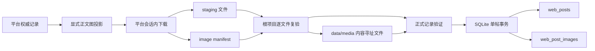

# 五平台正文图片本地存储工程实现方案

> 状态：主程序阶段 I-00 至 I-14 已完成，`MAIN_PROGRAM_READY=true`。
> 总验收证据见
> [`2026-08-07-image-main-program-i14-report.md`](2026-08-07-image-main-program-i14-report.md)。
>
> 适用平台：B站 article、微博图文、小红书图文、抖音图文、知乎 answer/article。
> 功能边界：只处理正文图片；视频、音乐、视频封面、搜索预览和作者头像不进入本地化范围。

## 1. 目标与固定决策

主程序把“只保存图片 URL”升级为“保存权威正文图 URL，并把全部正文图片保存到本地”。固定决策如下：

1. 正式有效记录的全部正文图片必须本地化；任一图片失败时整帖不入库，也不兑现新增数量目标。
2. 项目只开放语义明确的 `--download-images`；原始 `--get-media` 入口继续禁止，防止触发视频下载。
3. 图片由持有当前平台登录态和客户端的进程下载。B站使用根项目 article 分支，其余平台使用
   MediaCrawler 对应平台进程。
4. 平台进程只写本轮 staging 和逐图 manifest；根项目复验后晋升到 `data/media/` 并写入 SQLite。
5. `web_post_images` 是帖子、来源图片与本地文件的最终对应表。
6. 图片选择使用平台显式字段投影，不递归扫描记录中的任意 URL。
7. `image_index` 是同一 `image_role` 内从 0 开始的来源顺序；稳定资源键不依赖易过期的完整签名 URL。
8. 图片下载失败时不推进当前来源页，不把候选写入持久已处理集合，不降级为 URL-only 入库。

不在本工程范围内的事项：头像下载、截图归档、OCR、去水印、转码、压缩、跨帖子物理去重、
对象存储和视频能力。

## 2. 总体架构



责任边界：

- `image_candidates.py`：正文图字段投影、资源顺序、稳定资源键和排除规则。
- MediaCrawler 平台 store：使用当前会话下载、校验响应、原子写 staging、生成 manifest。
- `image_manifest.py`：定义跨进程 manifest schema。
- `image_materialization.py`：复验 manifest、计算真实元数据、晋升长期文件。
- `mediacrawler_crawl.py`：把内容有效性、图片完整性和 SQLite 事务串成正式完成谓词。
- `crawl_runner.py` / `xhs_runner.py`：强制图片模式并冻结完成证据。

## 3. 正文图片投影契约

| 平台 | 权威正文图来源 | 稳定资源键 | 明确排除 |
|---|---|---|---|
| B站 article | 详情正文 `image_urls` | 规范化正文 URL 的稳定摘要 | 搜索预览、封面、头像 |
| 微博 | `mblog.pics` / 正式 `image_list` | `pic_id`，缺失时使用规范化 URL 摘要 | 头像、封面、视频 |
| 小红书 | 笔记详情 `image_list` | 图片对象 ID，缺失时使用规范化 URL 摘要 | 头像、视频、同图 CDN 变体 |
| 抖音 | `images[]` / `note_download_url` | `images[].uri` | 封面、视频、音乐、头像 |
| 知乎 | 正文 HTML / 详情 `image_list` | 规范化正文 URL 摘要 | 公式、头像、作者主页、zvideo |

每个 `ImageCandidate` 至少包含：`platform_key`、`platform_post_id`、`source_key`、
`source_index`、`source_asset_key`、`download_url` 和受控请求上下文。投影结果按来源顺序稳定，
只对同一权威图片对象去重，不把 URL 查询参数差异误判为新正文图。

头像过滤是字段级白名单，不依赖图片尺寸或模型判断。只有上表列出的正文来源字段可以生成下载
候选；`avatar_url`、`author_avatar`、`user.avatar` 等作者资源只允许作为 URL 参考关系存在，
不得进入 manifest 或 `data/media/`。

## 4. manifest 与文件契约

每个候选对应一条 manifest 记录，至少包含：

```text
schema_version
platform_key
platform_post_id
source_key
source_index
source_asset_key
source_url
staging_relative_path
size_bytes
mime_type
width
height
sha256
fetch_status
attempts
error_code
```

约束：

- manifest 路径必须相对本轮输出根，不接受绝对路径、`..` 或符号链接逃逸。
- 同一帖子内 `source_index` 连续且唯一；`source_asset_key` 不得重复。
- `fetch_status=downloaded` 时文件必须存在，大小、MIME、尺寸和 SHA-256 全部匹配。
- 失败项必须保留分类和尝试次数，不得伪造成功记录或只写 URL。
- 摘要只保存计数、受控路径和错误码，不输出 Cookie 或带敏感查询参数的完整 URL。

## 5. staging、长期路径与文件安全

长期根目录固定为 `data/media/`，路径格式为：

```text
data/media/<platform>/<safe_platform_post_id>/<source_index:03d>-<sha256前16位>.<真实扩展名>
```

写入步骤：

1. 平台进程写随机名 `.part`。
2. 下载时限制响应体；完成后校验魔数和解码结果，再用 `os.replace()` 原子落为 staging 文件。
3. 根项目按 manifest 重新计算大小、MIME、尺寸和 SHA-256。
4. 长期目标不存在时，复制到同目录 `.part`，`fsync` 后原子改名。
5. 长期目标已存在且 SHA 一致时复用；同名但 SHA 不一致时立即失败。
6. SQLite 事务只引用已经存在且复验通过的长期文件。

允许 JPEG、PNG、WebP、GIF 和 AVIF。拒绝 SVG、HTML、JSON、音视频、未知二进制、超过 20 MiB
的文件和超过 150,000,000 像素的解码结果。每次重定向都重新执行 scheme、host 和本地/私网地址
检查。Pillow 只用于验证与读取尺寸，不重编码原图。

## 6. SQLite 对应关系

成功后的 `web_post_images` 正文行固定写入：

| 字段 | 语义 |
|---|---|
| `image_role` | `content` |
| `image_index` | 权威来源序列中的 `source_index` |
| `image_url` | 当前平台权威 URL |
| `local_path` | 相对项目根的长期文件路径 |
| `width` / `height` | 根项目复验后的真实尺寸 |
| `mime_type` | 根项目复验后的真实 MIME |
| `sha256` | 根项目重新计算的文件 SHA-256 |
| `raw_image_json` | 来源键、稳定资源键、manifest 位置和本地文件证据 |

upsert 重建图片关系前按以下顺序匹配旧行：

1. `image_role + source_asset_key`；
2. `image_role + 规范化 URL`；
3. 仅对没有稳定键的兼容记录使用 `image_role + source_index`，并再次验证 URL 身份。

匹配成功且本地文件存在、SHA 一致时可以更新来源 URL 并保留本地元数据。稳定键变化、文件缺失
或 SHA 不一致时不能沿用旧本地字段。主表与整帖全部图片关系在一个 SQLite 事务内提交；禁止提交
部分图片成功的帖子。

## 7. 平台实现要求

### 7.1 B站

- 只处理 article 详情正文图片，不进入视频下载分支。
- 必须有 `content_detail_status=detail_observed`；搜索摘要和预览图不能替代详情。
- 详情图片使用受控 Referer 下载，并产生与正文顺序一致的 manifest。

### 7.2 微博

- 从 `mblog.pics` 显式投影正文图，携带微博 ID、`pic_id` 和来源顺序。
- 下载复用当前微博会话；登录或频控失败按平台失败分类停止。
- 同一图片不同尺寸/CDN 变体只选择一个权威下载 URL。

### 7.3 小红书

- 由独立 `xhs_runner.py` 管理账号、租约、搜索连续性和作者详情。
- 每个 `image_list` 对象只下载一个正文 URL，不下载头像或视频。
- 正式 child 始终启用本地图片并同时满足作者字段、搜索连续性和图片完整性。

### 7.4 抖音

- 只从 `images[]` 投影并调用图片路径；图片列表为空时直接返回。
- `get_aweme_video()` 在图片模式不可达。
- `cover_url`、`video_download_url` 和 `music_download_url` 永不进入候选或 manifest。

### 7.5 知乎

- 正文 HTML 按 `data-original`、`data-actualsrc`、`src` 优先级提取。
- 搜索记录缺图时使用 answer/article 详情补全后再下载。
- 公式、头像、作者主页和 zvideo 资源在候选生成前排除。

## 8. 执行器、重试与完成谓词

- 正式 runner 必须向 child 传入 `--download-images` 和冻结的 `--media-root`。
- `--no-import` 可以生成 staging 与 manifest，但不能晋升长期文件或写正式库。
- 单图片最多尝试 3 次；网络错误、超时、429 和 5xx 使用带随机抖动的指数退避。
- 401/403 不直接判永久无效，应先刷新当前会话或按平台规则重试。
- 默认同一帖子内串行；平台图片并发最多 2，小红书和抖音固定为 1。
- 图片失败时当前批次为 `runtime_failed`，来源前沿保持在安全位置。

完成链路仍使用五个冻结阶段：

| 阶段 | 图片门禁 |
|---|---|
| `plan_frozen` | 冻结图片必需标志、长期目录与限制版本 |
| `command_executed` | 证明执行项目图片模式，且视频能力关闭 |
| `artifacts_verified` | manifest 与 staging 文件逐项复验通过 |
| `persistence_verified` | SQLite 路径、文件、SHA、尺寸、MIME 全部一致 |
| `task_finalized` | 图片完整性和数量/来源耗尽完成谓词同时成立 |

无论 `target-new-posts` 还是 `source-exhausted`，都必须满足
`image_materialization.complete=true` 与 `local_images_complete=true`。

## 9. 测试与验收矩阵

### 9.1 单元测试

- 五平台权威字段投影、来源顺序和稳定资源键正确。
- 头像、封面、搜索预览、视频、音乐和知乎公式不会生成 `ImageCandidate`。
- XHS 同一图片多个 URL 变体只生成一个候选。
- manifest 的路径穿越、绝对路径、重复序号、身份不一致和缺字段被拒绝。
- HTML、JSON、视频、伪造扩展名、超限文件与解码炸弹被拒绝。
- 晋升重跑幂等；已有目标 SHA 冲突时失败。
- upsert 能在签名 URL 变化后按稳定资源键保留正确本地元数据。
- 整帖任一图片失败时不提交该帖。

### 9.2 MediaCrawler 测试

- 微博、抖音、知乎和 XHS 的 manifest 与平台正文对象一一对应。
- 抖音图片模式不会调用视频下载。
- 知乎搜索图片和详情图片汇入同一权威正文序列。
- 所有 store 使用真实文件类型和原子 staging 写入。

### 9.3 集成测试

- 通用 runner 与 XHS runner 都强制图片本地化。
- 正式模式缺少图片标志时失败，`--get-media` 始终失败。
- `--no-import` 不修改正式 SQLite 和 `data/media/`。
- 临时库中正文图片行全部具有有效 `local_path`，文件 SHA 与数据库一致。
- `PRAGMA quick_check`、`foreign_key_check` 和唯一索引通过。
- 图片失败时 `persistence_verified` 不完成，checkpoint 不越过失败来源。
- 重跑同一记录不增加帖子、图片关系或重复长期文件。

## 10. 分步实施与独立验收

每一步都遵循：确认前置报告与 Git HEAD；只改本步骤范围；先跑专属测试再跑受影响回归；失败即
停止；通过后形成中文 Git commit；报告记录文件、命令、测试计数、产物与未解决事项。

### I-00：冻结实现基线

动作：记录根项目和 MediaCrawler HEAD、运行环境、默认库只读统计、冻结文件校验与磁盘空间。

验收：工作树范围明确；`verify_frozen_files.py` 通过；临时测试根不指向正式 SQLite 或
`data/media/`；形成 I-00 基线报告。

### I-01：显式正文图投影与头像过滤

动作：实现五平台 `ImageCandidate` 投影，替换正式路径上的递归 URL 扫描。

验收：五平台正例顺序正确；头像等全部反例候选数为 0；原文本字段测试通过。

### I-02：稳定资源键与 manifest schema

动作：实现 URL 规范化、稳定键、manifest 数据结构与 JSONL 读写。

验收：签名参数变化不改变稳定身份；schema 缺失、重复和路径越界测试失败方式明确。

### I-03：文件安全、staging 与长期晋升

动作：实现流式限制、魔数/解码校验、SHA、原子写入和内容寻址晋升。

验收：允许格式全通过，禁止格式与超限样本全拒绝；幂等复用和冲突失败测试通过。

### I-04：SQLite 图片关系与 upsert

动作：把稳定键与本地证据写入 `web_post_images`，实现整帖事务和旧关系安全匹配。

验收：临时库 schema、唯一索引、外键、保留/清空本地元数据和事务回滚测试通过。

### I-05：B站适配

动作：详情正文投影、下载、manifest 和根项目验证串联。

验收：预览/封面候选为 0；详情正文顺序一致；详情失败不推进来源。

### I-06：微博适配

动作：`mblog.pics` 显式映射、会话下载和 manifest。

验收：`pic_id`、顺序、文件逐项对应；头像/封面为 0；失败不产成功 manifest。

### I-07：小红书适配

动作：单对象单 URL、真实文件类型、manifest，并接入独立 runner。

验收：视频和头像路径不可达；多 CDN 变体不重复；账号、作者详情和图片门禁同时通过。

### I-08：知乎适配

动作：正文/详情图提取、公式过滤、会话下载和 manifest。

验收：answer/article 正文图通过；公式、头像、作者主页和 zvideo 候选为 0。

### I-09：抖音严格 images-only 适配

动作：保留 `images[].uri`，只调用图集下载，封闭所有视频回退。

验收：图文产生正文 manifest；视频作品和空图片列表不调用视频下载；封面/音乐为 0。

### I-10：根执行器物化与导入编排

动作：在内容验证后复验并晋升图片，再执行整帖 SQLite 导入。

验收：完整帖子成功；单图失败时帖子、关系和数量目标均不提交；`--no-import` 无正式写入。

### I-11：runner、冻结状态与完成谓词

动作：通用与 XHS runner 强制图片参数，把 manifest 和本地关系纳入五阶段状态。

验收：缺图片参数、证据或本地文件时任务不能完成；数量和来源耗尽模式均执行图片门禁。

### I-12：五平台综合回归

动作：执行主仓库与 MediaCrawler 全量测试，并进行五平台受控小样验证。

验收：测试全绿；图片失败分类可诊断；正式库与长期媒体根在 `--no-import` 验证中不变。

### I-13：文档、运维与冻结哈希同步

动作：同步契约、架构、持久化、平台能力、运行手册与冻结文件哈希。

验收：文档链接有效；冻结校验通过；文档 CLI、路径、字段和代码一致。

### I-14：`MAIN_PROGRAM_READY` 总验收

动作：复跑全量测试、冻结校验、临时库端到端、manifest/文件/SQLite 对账和 Git diff 审计。

验收标准：

1. I-00 至 I-13 报告全部通过。
2. 主项目与 MediaCrawler 测试通过，工作树变更范围可解释。
3. 五个平台的正文图正例和无用资源反例覆盖完整。
4. 临时端到端中 manifest、长期文件和 SQLite 关系逐项一致。
5. `quick_check`、外键、路径根、SHA、MIME 和尺寸复验通过。
6. 正式 runner 强制图片模式，视频下载路径不可达。
7. 正式完成谓词不能被 URL-only、staging-only 或部分帖子绕过。
8. 总验收报告明确记录 `MAIN_PROGRAM_READY=true`。

## 11. 运行验证命令

```bash
source .venv/bin/activate
python scripts/verify_frozen_files.py
python -m pytest -q
python -m compileall -q src scripts
git diff --check
```

数据库与文件验收还应检查：

```sql
PRAGMA quick_check;
PRAGMA foreign_key_check;

SELECT COUNT(*)
FROM web_post_images
WHERE image_role = 'content'
  AND (local_path IS NULL OR local_path = '');
```

正式运行的摘要、execution state、child summary、manifest、SQLite 关系和 `data/media` 文件必须按
这一顺序对账。任何一层计数或哈希不一致时任务失败，不用下游结果掩盖上游缺口。

## 12. 故障与回滚

- 下载或验证失败：保留 staging、manifest 和日志，不推进 checkpoint；修复后从安全前沿重跑。
- 长期文件冲突：停止并比较目标与来源 SHA，不覆盖现有文件。
- SQLite 事务失败：回滚整帖；内容寻址产生的无引用文件不影响已有关系。
- manifest 损坏：整批重新生成，不能手工补写成功行。
- 磁盘不足：在 child 启动前停止；不得边下载边删除本轮证据或长期文件。
- 代码或冻结文档漂移：重新审计差异并更新对应验收报告，不能跳过冻结校验。

主程序完成定义仅是长期能力成立：以后每轮正式抓取都能自动过滤无用图片、下载全部正文图、
复验、晋升、入库并提供可核验的完成证据。
