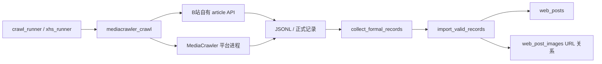
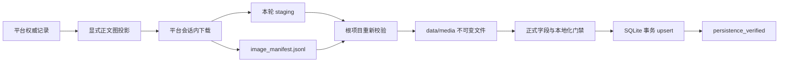

# 五平台正文图片本地存储工程实现方案

> 状态：待实现。本文是当前代码基线上的工程实施文档，不代表功能已经上线。
>
> 基线日期：2026-08-07。
>
> 适用范围：B站 article、微博图文、小红书图文、抖音图文、知乎 answer/article。
> 当前约束：只处理正文图片；视频、音乐、视频封面和作者头像不进入本次本地化范围。

## 1. 结论与固定决策

五个平台都已经具备正文图片 URL 发现能力，可以在不改变现有文本抓取、分页和候选记忆语义的
前提下增加本地图片存储。实现必须遵守以下固定决策：

1. 正式抓取从“保存图片 URL”升级为“保存图片 URL，并完整保存全部正文图片到本地”。任一正式
   有效记录只要有一张正文图片未完成本地化，就不能入库，也不能兑现新增目标。
2. `--get-media` 继续作为禁止使用的原始媒体开关；项目只开放语义明确的
   `--download-images`。任何正式路径都不得下载视频、音乐或音频。
3. 图片字节由拥有当前登录态和平台客户端的进程获取：B站由根项目 article 分支获取；微博、
   小红书、抖音和知乎由对应 MediaCrawler 平台进程获取。
4. 平台进程只把文件写入本轮 staging，并生成逐图片 manifest；根项目负责重新校验、晋升到长期
   目录、写入 SQLite 和生成完成证据。
5. 长期文件固定保存在 `data/media/`。`outputs/` 仍是本轮 staging 和审计产物，不作为新实现的
   长期主存储。
6. `web_post_images` 继续作为帖子与本地文件的最终关系表。现有 `local_path`、尺寸、MIME 和
   SHA-256 字段足以表达成功结果，本期不增加主库成功态表。
7. 图片选择必须改为平台显式字段映射；正式入库和下载均不得继续使用递归扫描任意 URL 字段的
   `dedupe_image_urls()`。
8. `image_index` 改为同一 `image_role` 内从 0 开始的来源顺序；正文图身份使用平台稳定资源键，
   不能仅依赖可能过期或变化的完整 URL。
9. 图片下载失败属于可恢复运行失败时，当前来源页不得推进，候选不得进入持久已处理集合；不得
   降级成只保存 URL。
10. 历史补下载不兑现 `target_new_posts`，不修改发现 checkpoint、候选记忆或来源耗尽状态。

## 2. 当前实现与库存基线

### 2.1 当前调用链



当前 `scripts/mediacrawler_crawl.py` 会递归扫描记录中的 `cover`、`image`、`img`、`pic`、
`avatar` 和 `note_download` 等键，再把命中的 URL 写入 `web_post_images`。这种通用扫描适合早期
字段探索，不适合作为正式正文图片契约：它会把封面、作者主页 URL、音乐或视频下载地址误归为
正文图，也会把同一图片的多个 CDN 变体保存为多张图片。

当前 upsert 会删除并重建同一帖子的全部 `web_post_images`。除小红书外，本地元数据只按完整 URL
保留；抖音等平台的签名 URL 更新后会失去本地文件对应关系。

### 2.2 2026-08-07 默认库审计快照

以下统计来自 `data/trippostcollect.sqlite` 和已完成的小红书本地路径回填报告，只用于确定迁移
边界，不作为未来固定数量：

| 平台 | 帖子 | 当前 `content` 行 | 平台权威正文图 | 已有本地路径 | 需要处理的问题 |
|---|---:|---:|---:|---:|---|
| B站 | 3,009 | 18,053 | 18,053 | 0 | 3 条 URL 存在协议/规范化差异 |
| 微博 | 1,007 | 6,384 | 6,384 | 0 | 当前关系与 `image_list` 全部一致 |
| 抖音 | 461 | 4,991 | 4,528 | 0 | 误含 461 封面、1 视频 URL、1 音乐 URL |
| 知乎 | 437 | 10,767 | 10,765 | 0 | 误含 2 条作者主页 URL；另有 437 张作者头像 |
| 小红书 | 1,808 | 21,040 | 17,416 | 17,150 | 多个 CDN 变体被展开；17 帖共 266 张尚未建立本地关系 |

五平台权威正文图合计 57,146 张。当前已建立本地路径 17,150 张，剩余待本地化 39,996 张，
其中 B站、微博、抖音、知乎合计 39,730 张，小红书缺口 266 张。

小红书现有回填的数据库备份、报告和逐文件 SHA-256 证据必须保留；新实现应读取并晋升这些文件，
不能重新下载已经验证成功的 17,150 张图片。

## 3. 目标与非目标

### 3.1 目标

- 五个平台的每条正式图文记录保存全部权威正文图片。
- SQLite 中每个正文图片行都能唯一对应本地文件、来源顺序、来源 URL 和稳定资源键。
- 本地文件经过类型、体积、尺寸和 SHA-256 校验，支持幂等重跑。
- 正式摘要、冻结阶段和数据库验收能证明图片已经落盘，而不是只证明 URL 非空。
- 抓取过程保持图片专用，不触发任何视频或音乐下载。
- 支持对默认库进行可恢复、分批、先 dry-run 后 apply 的历史补下载。
- URL 查询参数、签名或 CDN 域名变化时，已验证的本地图片关系不会被普通 upsert 清空。

### 3.2 非目标

- 不下载作者头像；`author_avatar` 关系继续只保存 URL。
- 不下载页面截图、页面证据层图片或 `ctf_capture_images` 中的远程资源。
- 不做图片 OCR、内容识别、去水印、转码或压缩。
- 不做跨帖子物理去重、硬链接或对象存储；本期只记录 SHA-256，为以后去重保留条件。
- 不改变关键词、分页、候选硬上限、完成模式、作者字段或粉丝来源。
- 不把历史补下载结果计入新抓取数量，不重置任何抓取记忆。

## 4. 目标架构



该架构把职责分成两层：

- 平台层拥有登录态、Cookie、签名 URL 和平台专用请求头，只负责可靠获取字节并产出 manifest。
- 根项目拥有正式字段契约、长期路径、文件安全、SQLite 关系、摘要和冻结状态，只负责验证和提交。

平台层不得直接修改主库；根项目不得把 Cookie、Storage State 或完整请求头写入 manifest。

## 5. 正文图片投影契约

新增根项目函数：

```python
content_image_candidates(platform_key: str, record: dict[str, Any]) -> list[ImageCandidate]
```

`ImageCandidate` 至少包含：

```text
platform_key
platform_post_id
image_role = content
source_index
source_url
source_key
source_asset_key
```

平台字段固定如下：

| 平台 | 权威输入 | 规则 |
|---|---|---|
| B站 | 详情补全后的 `image_urls` | 仅接受 `content_images_detail_status=detail_observed` 的详情图片 |
| 微博 | store 归一后的 `image_list` | 来源必须是 `mblog.pics`，保持原顺序并去重 |
| 小红书 | `image_list[]` | 每个图片对象只选择 `url_default`、`url`、`url_pre` 中优先级最高的一条 |
| 抖音 | `note_download_url` | 按逗号拆分图文列表；明确排除 `cover_url`、`video_download_url`、`music_download_url` |
| 知乎 | `image_list` | 仅正文 HTML 图片；继续排除 `/equation?` 公式图片 |

所有 URL 先统一处理协议相对地址、空白和明显尾部标点。正文图去重只在同一帖子内进行，并保持
第一次出现的正文顺序。`post_images_count` 必须等于投影后的 `content` 数量。

正式路径完成迁移后，`dedupe_image_urls()` 不再参与 `row_for_record()` 和
`validate_formal_record()`。如果没有其他当前调用方，按项目工程规则直接删除，不保留旧兼容分支。

## 6. 稳定资源身份

完整 URL 仍保存在 `image_url`，但匹配本地文件时使用 `source_asset_key`：

| 平台 | 稳定键优先级 |
|---|---|
| B站 | `bfs` 资源路径中的资产哈希；否则规范化 host + path，忽略查询参数和图片变换后缀 |
| 微博 | `mblog.pics[].pid`；缺失时使用规范化 host + path |
| 小红书 | 现有 `/notes_pre_post/`、`/notes_post/`、`/notes/` 路径身份；否则 host + path |
| 抖音 | `images[].uri` 等原始资源 ID；缺失时使用签名 URL 的规范化 path，忽略查询参数 |
| 知乎 | 原图 URL 的规范化 path；去除尺寸/格式变换部分后生成键 |

键格式固定带平台前缀，例如 `weibo:pid:<pid>`、`douyin:uri:<uri>`。无法取得平台资产 ID 时，
使用规范化 URL 的 SHA-256，不使用 Python 进程随机 hash。

抖音当前归一化记录只保留逗号字符串，需要在 MediaCrawler store 中额外保留不含敏感凭据的
`image_assets` 元数据，以便根项目取得 `uri` 和来源顺序。微博 manifest 同样直接记录 `pid`，
不依赖保存后的纯 URL 反推。

## 7. 下载 manifest 契约

每个平台每轮生成一个 UTF-8 JSONL 文件：

```text
<batch_dir>/<platform>/data/<mediacrawler-key>/image_manifest.jsonl
```

每行对应一张权威正文图，schema v1 如下：

```json
{
  "schema_version": 1,
  "platform_key": "douyin",
  "platform_post_id": "123456",
  "image_role": "content",
  "source_index": 0,
  "source_key": "note_download_url",
  "source_asset_key": "douyin:uri:example",
  "source_url": "https://example.invalid/image",
  "fetch_status": "downloaded",
  "attempts": 1,
  "http_status": 200,
  "staging_path": "douyin/images/123456/000.bin",
  "size_bytes": 1024,
  "mime_type": "image/jpeg",
  "width": 1080,
  "height": 1440,
  "sha256": "64位十六进制",
  "error_code": null
}
```

约束：

- `staging_path` 必须相对本轮平台数据目录，不能是绝对路径或包含 `..`。
- 成功行必须同时有文件、大小、MIME、尺寸和 SHA-256；失败行不得伪造这些字段。
- manifest 不保存 Cookie、请求头、Storage State、作者原始身份或响应正文。
- 控制台和摘要不打印带签名的完整 URL，只打印 host、资源键摘要和错误码。
- 同一 `(platform_key, platform_post_id, image_role, source_index)` 只能有一个最终状态；重试事件
  放在平台日志，manifest 保存最终结果和总尝试次数。
- 根项目必须重新计算 SHA-256、真实类型和尺寸，不能信任平台进程单方面提供的值。

## 8. staging、长期路径与文件安全

### 8.1 路径

在 `trippostcollect.core.paths` 增加：

```text
LOCAL_MEDIA_ROOT = DATA_ROOT / "media"
IMAGE_MATERIALIZATION_RUNTIME = RUNTIME_ROOT / "image_materialization"
```

长期路径固定为：

```text
data/media/<platform>/<safe_platform_post_id>/<source_index:03d>-<sha256前16位>.<真实扩展名>
```

`local_path` 保存相对项目根目录的 POSIX 路径。帖子 ID 只允许 ASCII 字母、数字、下划线和连字符；
其他字符编码为其 SHA-256 前缀，禁止把平台文本直接拼成目录名。

### 8.2 写入与晋升

1. 平台进程在 staging 同目录写入随机名 `.part`。
2. 下载完成后检查体积和文件头，再以 `os.replace()` 原子改为 staging 正式文件。
3. 根项目重新验证 manifest 与文件。
4. 根项目按内容 SHA-256 生成不可变长期路径；目标已存在且 SHA 一致时直接复用。
5. 目标不存在时先复制到长期目录的 `.part`，`fsync` 后原子改名。
6. 不覆盖 SHA 不一致的已有文件；出现冲突立即失败并保留证据。
7. SQLite 事务只引用已经存在且验证通过的长期文件。

文件晋升与 SQLite 无法组成单一原子事务，因此长期文件采用内容哈希不可变命名。数据库提交失败
最多产生无引用文件，不会破坏已有关系；无引用文件由独立、默认 dry-run 的垃圾回收工具处理。

### 8.3 允许类型与限制

- 首期只接受魔数和解码器都能确认的 JPEG、PNG、WebP、GIF 和 AVIF。
- SVG、HTML、JSON、音视频和 `application/octet-stream` 不得作为正式正文图片完成。
- 单文件上限使用独立的归档图片限制；初始值 20 MiB。超过限制记录
  `image_too_large`，不截断保存。
- 解码前限制响应体，解码后限制最大像素数；初始最大 100,000,000 像素。
- 对重定向后的每个 URL 重新执行 scheme、host 和本地/私网地址检查。
- PIL 仅用于验证和读取尺寸，不对原图重编码。

现有 `image_proxy.py` 的 URL、重定向、Referer、类型和体积校验应抽为共享的只读验证组件；批量
归档不得直接调用面向管理端预览的 `fetch_remote_image_preview()`，因为归档需要平台会话、重试、
staging、manifest 和更完整的错误分类。

## 9. SQLite 持久化语义

### 9.1 主表不新增字段

成功后的 `web_post_images` 固定写入：

| 字段 | 值 |
|---|---|
| `image_index` | `image_role` 内的 `source_index` |
| `image_url` | 当前平台权威 URL |
| `image_role` | 本期正式图片固定为 `content` |
| `local_path` | 项目相对长期路径 |
| `width` / `height` | 根项目验证后的真实尺寸 |
| `mime_type` | 根项目验证后的真实 MIME |
| `sha256` | 根项目重新计算的 SHA-256 |
| `raw_image_json` | 来源键、稳定资源键、下载 URL、manifest 位置和本地文件证据 |

`raw_image_json` 的目标结构：

```json
{
  "source_key": "image_list",
  "source_index": 0,
  "source_asset_key": "weibo:pid:example",
  "local_file": {
    "source": "formal_image_materialization_v1",
    "source_url": "https://example.invalid/image",
    "manifest_path": "outputs/.../image_manifest.jsonl",
    "manifest_line": 1,
    "size_bytes": 1024
  }
}
```

尺寸、MIME、SHA 和路径以表字段为查询权威，JSON 只保存来源审计信息。

### 9.2 upsert 改造

`upsert_web_post()` 重建图片行前必须建立旧行索引，匹配顺序固定为：

1. 相同 `image_role + source_asset_key`；
2. 相同 `image_role + 规范化 URL`；
3. 仅对没有稳定键的旧数据，在同一权威来源序列中使用 `image_role + source_index`，且必须验证
   来源 URL 身份一致。

匹配成功且本地文件仍存在、SHA 一致时，允许更新 `image_url` 并保留本地字段。稳定键变化、文件
缺失或 SHA 不一致时清空旧本地字段，必须重新本地化。删除后重建图片行仍可保留，但不能再以完整
签名 URL 作为唯一保护条件。

每个帖子在一个 SQLite 事务中完成主表和全部图片行更新。帖子只有在全部权威正文图均有验证后的
本地元数据时才能提交；禁止一张成功、一张失败后提交半个帖子。

### 9.3 无状态表的失败恢复

主库只保存成功关系。失败和重试状态保存在本轮 manifest、summary 和
`data/runtime/image_materialization/` 报告中：

- 新记录失败时不进入 `web_posts`，下一轮由未推进的来源前沿重新处理。
- 历史记录以 `local_path IS NULL`、文件缺失或 SHA 不一致作为待处理集合，重复执行即可恢复。
- 每次历史 apply 前创建 SQLite 一致性备份；报告记录输入集合摘要、映射摘要和前后数据库 SHA。

本期不增加下载任务表，避免与“失败新记录尚无 `web_post_images.id`”以及现有删除重建语义形成
第二套身份系统。如果后续需要跨主机任务队列，再单独设计持久队列表。

## 10. 平台实现

### 10.1 B站

- 所有权继续在根项目 `run_bilibili_article_search()`，不进入 MediaCrawler 视频分支。
- 使用 `extract_bilibili_detail_images()` 产生的详情图片序列；搜索预览图不得下载为正文图。
- 下载使用当前 article Cookie、文章 Referer 和浏览器 User-Agent。
- 在详情和作者字段通过初步门禁后下载，下载完整后记录才进入正式有效集合。
- 稳定键优先使用 B站 `bfs` 资产路径哈希。
- MediaCrawler 的 `BilibiliVideo` 和 `get_bilibili_video()` 不改造成图片入口，也不得被正式命令调用。

### 10.2 微博

- 继续使用 `mblog.pics` 和 `wb_client.get_note_image()`。
- `get_note_images()` 接收微博 ID，并按 `pics` 原始顺序传递 `source_index`、`pid` 和 URL。
- 取消只按 `<picid>.<url后缀>` 平铺的正式存储语义；staging 改为逐帖目录。
- 扩展名由响应和文件头确定，不使用 `url.split(".")[-1]`。
- 只有正式字段初步有效的图文候选才下载；已知 ID 继续在媒体处理前跳过。

### 10.3 小红书

- 保留现有 `get_notice_media()` 的图片专用语义和禁用视频分支。
- `get_note_images()` 不再把所有文件强制命名为 `.jpg`，改为真实格式和 manifest。
- 每个 `image_list` 对象只下载一个权威 URL，避免 `url_default/url_pre` 变体重复入库。
- 先复用已验证的 17,150 个本地文件；17 帖共 266 张缺口通过正式账号会话重新取得详情后补齐。
- XHS 正式 runner 始终要求本地图片，不再把 `download_images` 作为可以关闭的业务能力。

### 10.4 抖音

- 正文图只来自 `_extract_note_image_list()` 和原始 `images[]` 资产元数据。
- 项目图片模式直接调用 `get_aweme_images()`；如果图片列表为空就返回，不得调用
  `get_aweme_video()`。
- `cover_url`、`video_download_url` 和 `music_download_url` 永远不进入候选、manifest 或本地目录。
- 新抓记录必须在当前 `dy_client` 仍存活时立即下载，避免签名 URL 过期。
- 历史 URL 先尝试直接下载；403、签名错误或 URL 过期时按 `aweme_id` 请求一次新详情，仅刷新图片
  资产列表，再下载并更新 `image_url`。刷新不得重新跑关键词发现或推进 checkpoint。
- 只有刷新后的详情仍明确不存在该图片，且作品状态给出决定性证据时，才能判永久无效；普通
  403、429、5xx、超时和解析失败均为可恢复失败。

### 10.5 知乎

- 继续使用 `extract_image_urls_from_html()` 的 `data-original`、`data-actualsrc`、`src` 优先级和
  公式排除规则。
- 在 Zhihu MediaCrawler client 中增加图片字节获取方法，复用当前 Cookie、User-Agent 和内容页
  Referer；新增知乎图片 staging store 和 manifest。
- 搜索响应有图时可直接下载；搜索缺图并完成详情补全时，必须下载详情合并后的 `image_list`。
- `avatar_url` 和 `author_profile_url` 不进入正文图片投影。

## 11. 根项目执行器改造

### 11.1 CLI 语义

- `scripts/mediacrawler_crawl.py --download-images` 扩展为五平台安全图片模式。
- `--get-media` 继续立即失败，错误信息明确说明只能使用项目图片模式。
- 通用 `crawl_runner.py` 为所有正式 `mediacrawler_search` child 强制加入 `--download-images`。
- `xhs_runner.py` 的正式计划固定 `local_image_storage_required=true`，正式 child 强制加入该参数。
- `config/xhs_targets.json` 及当前仍在使用的同 schema one-off 配置删除可选
  `download_images` 字段；本地图片是正式契约，不再由目标配置决定是否开启。
- `config/crawl_targets.json` 不新增逐 job 图片开关，避免同一正式 profile 同时存在 URL-only 和
  本地化两种完成语义。
- `--no-import` 诊断允许不下载图片；若显式传 `--download-images`，只生成 staging 和 manifest，
  不晋升长期目录、不写主库，也不能作为正式完成证据。

正式模式缺少 `--download-images` 不是可降级配置，而是计划或命令构造错误。

### 11.2 验证与导入顺序

`mediacrawler_crawl.py` 主流程调整为：

1. 执行平台抓取并取得记录、staging 和 manifest。
2. 运行现有行为、策略、分页和字段校验。
3. 对准备进入有效集合的记录执行平台显式正文图投影。
4. 校验每帖 manifest 的资源键、顺序、数量、文件路径和字节元数据。
5. 将通过的文件晋升到 `data/media/`，形成 `MaterializedImage`。
6. 把 `MaterializedImage` 注入待入库记录。
7. 只有字段目标和图片本地化目标同时满足时执行 `import_valid_records()`。
8. 写摘要、发现 checkpoint 和最终退出状态。

不能先提交数据库再补路径。晋升成功但 SQLite 失败时保留不可变文件并报告无引用文件；下一次
相同内容可直接复用。

### 11.3 摘要字段

child summary 新增：

```json
{
  "image_materialization": {
    "required": true,
    "candidate_posts": 10,
    "expected_images": 86,
    "downloaded_images": 86,
    "reused_images": 0,
    "promoted_images": 86,
    "retryable_failures": 0,
    "terminal_failures": 0,
    "complete": true,
    "manifest_paths": [],
    "manifest_sha256": "..."
  }
}
```

`formal_validation` 新增：

```text
local_images_required
local_images_complete
valid_local_image_count
invalid_local_image_reason_counts
```

标准错误码至少包括：

```text
missing_image_manifest
image_manifest_count_mismatch
image_manifest_identity_mismatch
image_path_escape
image_file_missing
image_too_large
image_non_raster_response
image_decode_failed
image_hash_mismatch
image_download_retryable
image_refresh_failed
image_promotion_conflict
```

摘要只保存计数、受控路径、稳定键摘要和错误码，不输出 Cookie 或带敏感查询参数的完整 URL。

## 12. 正式完成与冻结阶段

不新增第六个冻结阶段，图片证据并入现有五阶段：

| 阶段 | 新增图片门禁 |
|---|---|
| `plan_frozen` | 冻结 `local_image_storage_required=true`、长期目录和图片限制版本 |
| `command_executed` | 证明执行的是项目图片模式，而不是原始媒体模式 |
| `artifacts_verified` | manifest 存在、SHA 固定、staging 文件逐项验证通过 |
| `persistence_verified` | SQLite 正文图片数、本地路径、文件存在、SHA、尺寸和 MIME 全部一致 |
| `task_finalized` | 图片本地化完成谓词与原数量/来源耗尽谓词同时成立 |

默认数量模式和显式来源耗尽模式都必须满足 `local_images_complete=true`。图片失败时：

- 可恢复错误：child 停止为 `runtime_failed`，当前页保持未完成，候选不写入已处理集合，不入库。
- 决定性永久无效：候选可以作为无效候选继续，但必须有平台详情证据，不能只凭 CDN 404/403。
- 不允许 `local_path=NULL` 的正式正文图通过 `persistence_verified`。
- 不允许用“文件已在 staging”替代长期文件和数据库关系验证。

实现阶段需要同步更新受限冻结的 `formal-crawl-contract.md` 和 `crawl-architecture.md`，并更新冻结
哈希。该治理变更必须与代码、测试和平台文档在同一实施批次完成，不能只改其中一层。

## 13. 历史数据清理与补下载

新增正式历史入口：

```text
scripts/materialize_local_images.py
```

该入口默认 dry-run；写默认库必须显式 `--apply`，并自动创建 SQLite backup。它不得调用正式
runner，不得改变任何抓取记忆。

### 13.1 前置关系修复

1. 从每条 `raw_sample_json` 按第 5 节重新生成权威正文图序列。
2. 输出逐平台预期行数、删除误分类数、合并变体数和 URL 规范化数。
3. 在临时 SQLite 执行关系重建，验证主表行数不变、外键和唯一索引通过。
4. 保留已有、可验证且稳定键一致的本地字段。
5. 默认库 apply 前创建备份，并对修复前后每帖正文和非图片字段做哈希不变量校验。

当前库的预期修复结果：

- 抖音正文图片从 4,991 调整为 4,528，移除 463 条非正文媒体 URL。
- 知乎正文图片从 10,767 调整为 10,765，移除 2 条作者主页 URL。
- 小红书正文图片从 21,040 折叠为 17,416 个权威图片对象，并保留已验证的 17,150 个本地关系。
- 微博数量保持 6,384。
- B站数量保持 18,053，只规范化 3 条 URL 身份。

### 13.2 分平台补下载

执行顺序固定为：

1. 小红书已有文件晋升与 266 张缺口补齐；
2. B站；
3. 微博；
4. 知乎；
5. 抖音。

每个平台先固定 10 帖小样，再按受控批次运行。每批报告：计划帖子、计划图片、复用、下载、晋升、
更新、待重试、永久无效、字节总量、耗时、数据库备份和 SHA。只有当前批次每帖全部图片完成时才
更新该帖；不提交部分帖子关系。

抖音历史批次必须额外报告：旧 URL 直取成功、详情刷新成功、详情刷新失败和决定性永久无效。

### 13.3 现有小红书回填资产

`scripts/backfill_local_image_paths.py` 和
`src/trippostcollect/artifacts/local_image_backfill.py` 已经完成“现有文件到数据库”的严格映射，
继续作为这次迁移的输入和审计证据，不作为以后正式抓取路径。新历史入口复用其项目内路径、
SHA、MIME、尺寸和原始 JSONL 对应能力，再把已验证文件晋升到长期目录。

## 14. 重试、节流与并发

- 正式抓取保持现有浏览器和 API 并发规则；图片下载使用独立的小并发，不扩大搜索并发。
- 默认同一帖子内串行，平台级最多 2 个图片请求；抖音和小红书首期固定为 1。
- 单图片最多 3 次：网络错误、超时、429 和 5xx 使用带随机抖动的指数退避。
- 401/403 不直接判永久失败；抖音先刷新详情 URL，其他平台先刷新当前客户端 Cookie 或重试一次
  带平台 Referer 的请求。
- `Content-Length` 超限时不读取完整响应；没有长度时流式读取并在上限处终止。
- 图片请求计数和耗时写入 `image_materialization`，但不改变现有站点正式会话数量语义。
- 磁盘预检必须同时考虑 staging 和长期文件。历史全量前先用样本估算 p50/p95 文件大小，要求可用
  空间至少覆盖估算总量的 2 倍和安全余量。

## 15. 并发、幂等与垃圾回收

- 使用 `LOCK_DIR` 下的 `(platform, platform_post_id)` 文件锁，防止两个 child 同时晋升同一帖子。
- 内容哈希路径和 `os.replace()` 保证重复下载不会生成不同成功文件。
- 同一批次重复执行时，目标文件与 SHA 一致则计为 `reused_images`，不重新写入。
- 禁止在普通 upsert 中删除长期文件；正文图片被平台移除时只删除数据库关系，旧文件进入无引用态。
- 新增独立 `scripts/gc_local_images.py`，默认只输出无引用文件和总字节数。只有显式 `--apply`、完成
  数据库备份并再次确认引用集合后才允许删除；首期上线阶段不自动执行 GC。

## 16. 代码变更清单

### 16.1 根项目

| 文件 | 变更 |
|---|---|
| `src/trippostcollect/core/paths.py` | 增加长期图片根目录和图片运行状态目录 |
| `src/trippostcollect/artifacts/image_candidates.py` | 新增五平台显式投影、URL 规范化和稳定资源键 |
| `src/trippostcollect/artifacts/image_materialization.py` | manifest 校验、文件验证、晋升和数据库元数据构造 |
| `src/trippostcollect/artifacts/image_proxy.py` | 抽取可复用的远程响应安全校验，不承担批量归档编排 |
| `scripts/mediacrawler_crawl.py` | 替换递归图片提取、扩展安全图片模式、加入本地化门禁与摘要 |
| `scripts/crawl_runner.py` | 正式结构化 child 强制图片模式；冻结与验收图片证据 |
| `scripts/xhs_runner.py` | 正式 XHS 固定要求本地图片；验收 manifest 和本地关系 |
| `config/xhs_targets.json` | 删除可选 `download_images`，正式 XHS 固定要求本地图片 |
| 当前有效的 XHS one-off 配置 | 按同一 schema 删除可选 `download_images`，不保留旧兼容字段 |
| `scripts/materialize_local_images.py` | 新增历史清理、补下载、恢复和 apply 入口 |
| `scripts/gc_local_images.py` | 新增默认 dry-run 的无引用文件审计/清理入口 |
| `src/trippostcollect/artifacts/local_image_backfill.py` | 复用现有 XHS 证据并支持向长期目录晋升 |

### 16.2 MediaCrawler 定向补丁

| 文件 | 变更 |
|---|---|
| `tools/MediaCrawler/tools/image_manifest.py` | 新增原子 staging 写入和 JSONL manifest 公共实现 |
| `media_platform/weibo/core.py` | 传递微博 ID、pid、顺序和来源 URL；只下载初步有效图文 |
| `store/weibo/weibo_store_media.py` | 逐帖 staging、真实格式、返回 manifest 元数据 |
| `media_platform/douyin/core.py` | 新增严格 images-only 路径，删除正式图片模式的视频回退 |
| `store/douyin/__init__.py` | 保留 `images[]` 稳定资产元数据 |
| `store/douyin/douyin_store_media.py` | 原子 staging、真实格式和 manifest |
| `media_platform/zhihu/core.py` | 在正文/详情图片确定后下载并汇总状态 |
| `media_platform/zhihu/client.py` | 新增复用当前会话的图片字节请求 |
| `store/zhihu/zhihu_store_media.py` | 新增知乎图片 staging 和 manifest |
| `media_platform/xhs/core.py` | 每个图片对象只取一个 URL，真实格式、失败分类和 manifest |
| `store/xhs/xhs_store_media.py` | 原子 staging、真实格式和 manifest |

B站第三方视频下载代码不属于本功能修改范围。

### 16.3 文档与治理

实现完成时同步更新：

- `docs/README.md`
- `docs/data-persistence.md`
- `docs/platform-field-coverage.md`
- `docs/platforms/bilibili.md`
- `docs/platforms/weibo.md`
- `docs/platforms/douyin.md`
- `docs/platforms/zhihu.md`
- `docs/platforms/xhs.md`
- 受限冻结的 `docs/formal-crawl-contract.md`
- 受限冻结的 `docs/crawl-architecture.md`
- `config/frozen_files.json`

## 17. 测试方案

### 17.1 根项目单元测试

- 五个平台权威字段投影与顺序。
- 抖音封面、视频和音乐 URL 永远不产生 `ImageCandidate`。
- 知乎作者主页和头像不产生正文候选；公式图片继续排除。
- 小红书同一图片多个 URL 变体只产生一个候选。
- B站 HTTP/HTTPS、协议相对地址和变换 URL 得到相同稳定键。
- manifest 路径穿越、绝对路径、缺字段、重复序号和身份不一致被拒绝。
- HTML、JSON、视频、伪造扩展名、超限文件和解码炸弹被拒绝。
- SHA、MIME、尺寸和目标路径计算正确。
- 晋升重复执行幂等；已有路径 SHA 冲突时失败。
- upsert 在抖音签名查询参数变化后保留稳定键一致的本地元数据。
- upsert 在稳定资源键变化后清空旧本地关系并要求重新下载。
- 整帖一张失败时不提交任何该帖本地关系。

### 17.2 MediaCrawler 测试

- 微博 manifest 的 note ID、pid、顺序和文件一一对应。
- 抖音图文调用图片下载；视频候选和空图片列表都不调用 `get_aweme_video()`。
- 抖音图片失败不会写成功 manifest。
- 知乎搜索图片和详情补全图片使用同一正文列表。
- XHS 视频函数在图片模式下仍不可达。
- 所有 store 使用真实文件类型和原子写入。

### 17.3 执行器与数据库集成测试

- 通用正式 child 和 XHS 正式计划都要求图片本地化。
- `--get-media` 继续失败；正式模式缺少图片标志失败。
- `--no-import` 可生成 manifest，但不会晋升或写库。
- 临时 SQLite 中 `post_images_count`、正文图片行和非空 `local_path` 数量一致。
- 每个 `local_path` 都在项目长期目录内、文件存在、SHA 与数据库一致。
- `PRAGMA quick_check`、`foreign_key_check` 和唯一索引通过。
- 图片失败时 `persistence_verified` 不完成，发现 checkpoint 保持安全前沿。
- 重跑同一记录不增加主表、图片行或重复长期文件。

### 17.4 历史迁移测试

- 使用默认库副本验证第 13.1 节五个平台的预期关系数。
- 原 `web_posts` 行数、正文文本、作者、指标、发布时间、关键词和发现表哈希不变。
- 小红书 17,150 个现有本地文件全部通过晋升并保持 SHA。
- 固定每平台 10 帖小样下载成功后，再进入分批全量。

## 18. 灰度实施顺序

### 阶段 A：数据口径和纯本地组件

- 实现显式图片投影、稳定键、manifest 校验、长期路径和晋升。
- 修改 importer/upsert，但只在临时 SQLite 验证。
- 完成误分类关系 dry-run 报告，不修改默认库。

通过条件：全部单元测试通过，当前默认库副本得到第 13.1 节精确关系数。

### 阶段 B：小红书回归与长期目录

- 把已验证的 17,150 张图片晋升到 `data/media/xhs/`。
- 改造 XHS manifest 和真实格式检测。
- 用固定小样验证正式新记录的 URL、manifest、长期文件和数据库一次完成。

通过条件：现有 SHA 不变；视频目录无新增；重复执行零重复文件。

### 阶段 C：B站与微博

- 接入 B站根项目下载器和微博现有客户端。
- 每平台先 10 帖临时库，再执行历史分批。

通过条件：详情正文图/`mblog.pics` 与 manifest、长期文件和 SQLite 精确一致。

### 阶段 D：知乎

- 新增知乎客户端图片下载和 store。
- 验证搜索有图与详情补全两种路径。

通过条件：公式、头像和作者主页不入正文图片；10 帖小样全量本地化。

### 阶段 E：抖音

- 先合入并验证 images-only 不变量，再允许根项目为抖音传图片模式。
- 分别验证新鲜签名 URL、历史直取和详情刷新三条路径。

通过条件：没有任何视频/音乐请求或文件；签名变化后关系不丢失；10 帖小样全部本地化。

### 阶段 F：正式契约切换与历史全量

- 同步治理文档、冻结哈希、runner 完成门禁和运维说明。
- 按平台批次补齐历史 39,996 张缺口。
- 完成全库文件、关系、SHA、尺寸、MIME、外键和磁盘容量审计。

通过条件：第 19 节全部满足，才宣布五平台图片本地存储上线。

## 19. 验收标准

### 19.1 新抓取验收

每个正式有效帖子必须满足：

```text
post_images_count
= content image rows
= content rows with non-empty local_path
= manifest downloaded rows
```

并且：

- 每个本地路径都位于 `data/media/<platform>/`。
- 每个文件存在，数据库 SHA、MIME、宽高与重新检测一致。
- `raw_image_json.source_asset_key` 非空且同帖唯一。
- `image_index` 为正文图从 0 开始的连续序列。
- 摘要 `image_materialization.complete=true`。
- 冻结状态五阶段全部完成，`persistence_verified` 包含图片计数和校验摘要。
- `data/media/**/videos`、MediaCrawler `videos/` 和音乐目录没有本轮新增文件。

### 19.2 历史全量验收

- 权威正文图总数以迁移时默认库实时重算为准；当前基线为 57,146。
- 每个权威正文图片行都有本地路径，当前预期缺口从 39,996 降为 0。
- 作者头像仍为可选远程 URL，不因未本地化导致失败。
- `web_posts` 总行数不因补下载变化。
- 抖音非正文媒体误分类为 0，知乎作者主页误分类为 0，小红书变体重复为 0。
- 全库本地路径无越界、无缺失文件、无 SHA 冲突、无重复 `(post, role, index)`。
- `PRAGMA quick_check='ok'` 且 `PRAGMA foreign_key_check` 返回 0 行。
- 历史报告包含数据库备份、输入/输出计数、映射 SHA 和失败分类；待重试为 0，或存在用户逐项批准
  的独立排除清单。排除项不得伪装成本地化成功。

最低验收 SQL：

```sql
WITH content_images AS (
  SELECT
    p.platform_key,
    p.id AS web_post_id,
    p.post_images_count,
    COUNT(i.id) AS image_rows,
    SUM(CASE WHEN i.local_path IS NOT NULL AND i.local_path <> '' THEN 1 ELSE 0 END) AS local_rows
  FROM web_posts p
  LEFT JOIN web_post_images i
    ON i.web_post_id = p.id
   AND i.image_role = 'content'
  GROUP BY p.id
)
SELECT
  platform_key,
  COUNT(*) AS posts,
  SUM(post_images_count <> image_rows) AS relation_mismatches,
  SUM(image_rows <> local_rows) AS local_path_mismatches
FROM content_images
GROUP BY platform_key
ORDER BY platform_key;
```

正式验收要求五个平台的两个 mismatch 均为 0；SQL 之后仍必须逐文件校验 SHA，不能只看非空路径。

## 20. 回滚与故障处理

- 上线前保留代码提交点、默认库 SQLite backup、manifest 和文件晋升报告。
- 若某平台图片实现不稳定，暂停该平台正式 job；不得回退为 URL-only 并继续宣称正式完成。
- 数据库回滚使用上线前 SQLite backup；已经晋升的不可变文件可以保留为无引用文件，待独立 GC。
- 不删除已验证的小红书现有文件或路径，除非已确认新的长期副本存在且 SHA 一致。
- MediaCrawler 补丁回滚时同时回滚根项目对该平台图片模式的启用，防止重新进入视频回退路径。
- 图片失败排查顺序固定为 manifest 错误码、文件校验摘要、平台日志尾部、登录态和短小样；不全文
  展开 JSONL 或批量响应。

## 21. 完成定义

只有以下事项全部完成，本工程任务才算完成：

1. 五平台显式正文图投影替换通用递归提取。
2. 五平台安全图片下载、manifest、长期晋升和 SQLite 写回全部实现。
3. 正式 runner 把本地图片完整性纳入现有冻结完成门禁。
4. 单元、MediaCrawler、执行器、临时 SQLite 和每平台真实小样全部通过。
5. 历史误分类修复完成，已有小红书文件无损晋升，历史缺口补齐或有独立批准的排除项。
6. 视频、音乐和作者头像未进入正文图片本地化路径。
7. 受限治理文档、平台文档、数据持久化文档和冻结哈希与代码一致。
8. 默认库、长期文件目录、运行报告和数据库备份均通过最终审计。
